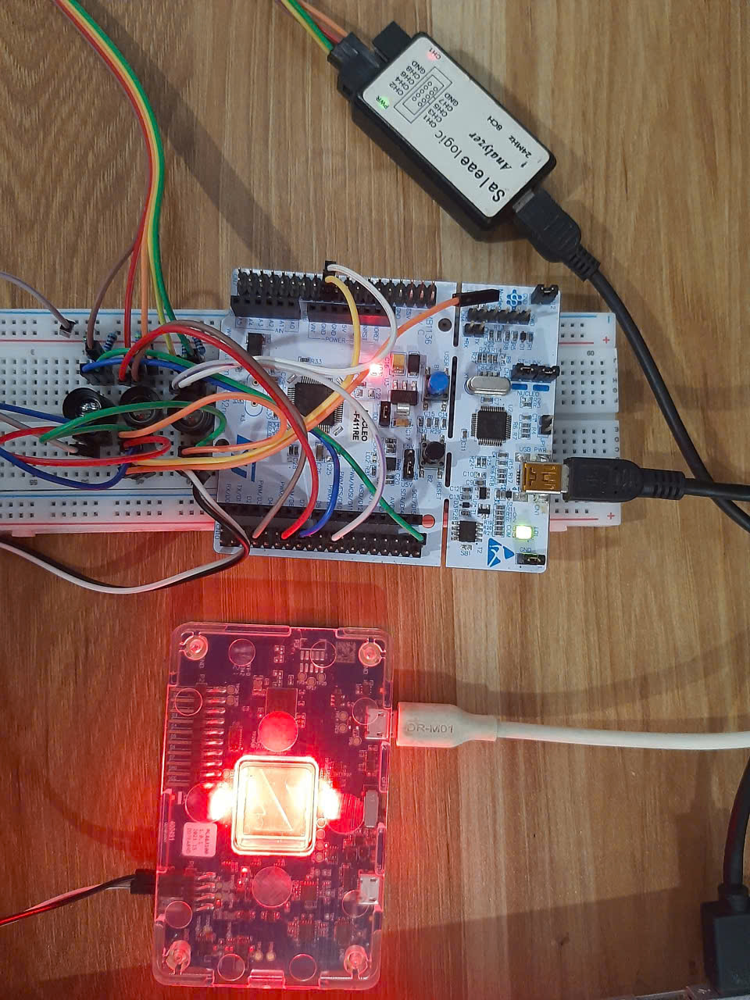
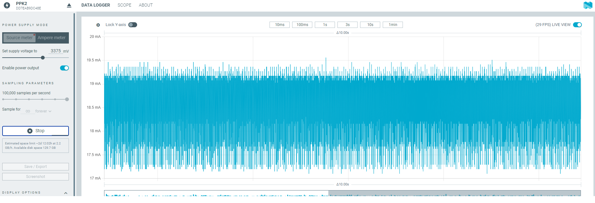

#  NUCLEO-F411RE comunicate with 3 HTPAD 32x32 Heiman sensors
This library is ported and optimized from ESP32 HTPAD Arduino code to support more sensor if more i2c available.
For stable runing, 3.375V from Power Profiler Kit II will be use.
### Pin connection
```
STM32F411RE       Heiman Sensor
PB7(SDA)    <-->  Pin 1(SDA)
PB6(SCL)    <-->  Pin 4(SCL)

PB3(SDA)    <-->  Pin 1(SDA)
PB10(SCL)   <-->  Pin 4(SCL)

PC9(SDA)    <-->  Pin 1(SDA)
PA8(SCL)    <-->  Pin 4(SCL)
```





